# Java IoC Web Server


A lightweight HTTP/1.1 web server built from scratch in Java, featuring an IoC (Inversion of Control) container powered entirely by **Java Reflection**. The framework mimics the annotation-driven model of Spring Boot, allowing plain Java objects (POJOs) to be automatically discovered and registered as web endpoints — without any external dependencies.


---

## Table of Contents

- [Architecture](#architecture)
- [How It Works](#how-it-works)
- [Project Structure](#project-structure)
- [Local Execution](#local-execution)
- [AWS EC2 Deployment](#aws-ec2-deployment)
- [Tests](#tests)

---

## Architecture

The framework is organized into four independent layers, each with a single responsibility:

```
┌─────────────────────────────────────────────────────────────┐
│                      MicroSpringBoot                        │
│              Entry point — launches IoC + server            │
└──────────────────────┬──────────────────────────────────────┘
                       │
          ┌────────────┴────────────┐
          │                         │
┌─────────▼──────────┐   ┌──────────▼──────────┐
│  ComponentScanner  │   │      HttpServer      │
│  [ ioc package ]   │   │   [ server package ] │
│                    │   │                      │
│  Scans classpath   │   │  Accepts TCP sockets │
│  Finds @RestCtrl   │   │  Parses HTTP/1.1     │
│  Instantiates POJO │   │  Routes GET requests │
│  Registers routes  │   │  Serves static files │
└────────────────────┘   └──────────────────────┘
          │
┌─────────▼──────────┐
│    Controllers     │
│ [ controller pkg ] │
│                    │
│  HelloController   │
│  GreetingCtrl      │
│  MathController    │
└────────────────────┘
```

### Annotations

| Annotation | Target | Purpose |
|---|---|---|
| `@RestController` | Class | Marks a POJO as a web component to be discovered by the scanner |
| `@GetMapping(value)` | Method | Maps a method to a specific GET HTTP endpoint path |
| `@RequestParam(value, defaultValue)` | Parameter | Binds a query string parameter to a method argument |

---

## How It Works

The IoC container operates entirely through Java Reflection at startup:

1. `MicroSpringBoot` starts and calls `ComponentScanner.scanAndRegister()`.
2. `ComponentScanner` iterates every `.class` entry in the JVM classpath (or JAR).
3. For each class, it calls `ClassLoader.loadClass()` and checks for `@RestController` via `cls.isAnnotationPresent()`.
4. Matching classes are instantiated with `cls.getDeclaredConstructor().newInstance()` — no configuration needed.
5. Each method is inspected via `cls.getDeclaredMethods()` for `@GetMapping`.
6. For each annotated method, `method.getParameters()` is read to find `@RequestParam` annotations.
7. A lambda wrapping `method.invoke(instance, args)` is registered in `HttpServer` for the corresponding path.
8. At request time, `HttpServer` parses the incoming HTTP request, resolves query parameters, and dispatches to the matching handler.

---

## Project Structure

```
java-ioc-webserver/
├── pom.xml                          # Maven build config — dependencies, plugins, JAR packaging
├── .gitignore                       # Files and folders excluded from version control
├── README.md                        # Project documentation (this file)
└── src/
    ├── main/
    │   ├── java/edu/eci/tdse/
    │   │   ├── MicroSpringBoot.java              # Entry point — launches IoC scan and HTTP server
    │   │   ├── annotation/                        # Custom annotations that define the framework API
    │   │   │   ├── RestController.java            # Marks a class as a web component to be discovered
    │   │   │   ├── GetMapping.java                # Maps a method to a specific GET endpoint path
    │   │   │   └── RequestParam.java              # Binds a query string parameter to a method argument
    │   │   ├── ioc/                               # Inversion of Control — reflection-based wiring
    │   │   │   └── ComponentScanner.java          # Scans classpath, instantiates controllers, registers routes
    │   │   ├── server/                            # Raw HTTP layer — sockets, parsing, routing, file serving
    │   │   │   ├── HttpServer.java                # TCP socket server — accepts connections and dispatches requests
    │   │   │   ├── HttpParser.java                # Parses raw HTTP/1.1 request text into structured objects
    │   │   │   ├── HttpRequest.java               # Data class representing a parsed HTTP request
    │   │   │   ├── QueryStringParser.java         # Extracts and decodes query parameters from URLs
    │   │   │   ├── StaticFileService.java         # Reads and serves static files from webroot
    │   │   │   └── MimeTypes.java                 # Maps file extensions to their MIME content types
    │   │   └── controller/                        # Demo controllers — plain POJOs annotated with @RestController
    │   │       ├── HelloController.java           # GET /hello — returns a plain Hello World message
    │   │       ├── GreetingController.java        # GET /greeting — personalized greeting with @RequestParam
    │   │       └── MathController.java            # GET /pi and GET /square — math utility endpoints
    │   └── resources/
    │       └── webroot/                           # Static files served directly without any controller
    │           ├── index.html                     # Landing page listing available endpoints
    │           ├── style.css                      # Stylesheet for the index page
    │           └── app.js                         # Client-side JavaScript for the index page
    └── test/
        └── java/edu/eci/tdse/
            ├── QueryStringParserTest.java         # Tests for URL query string parsing and URL decoding
            ├── MimeTypesTest.java                 # Tests for file extension to MIME type mapping
            ├── ComponentScannerTest.java          # Tests for annotation discovery and reflection wiring
            └── GreetingControllerTest.java        # Tests for greeting logic, @RequestParam, and counter
```

### Package breakdown

| Package | Responsibility |
|---|---|
| `annotation` | Contains the three custom annotations that define the framework's public API. These are retained at runtime (`RetentionPolicy.RUNTIME`) so reflection can read them at startup. |
| `ioc` | Contains `ComponentScanner`, the reflection engine. Responsible for discovering controllers, instantiating them, and wiring their methods to HTTP routes. |
| `server` | Contains the raw HTTP layer: socket server, request parser, query string parser, static file service, and MIME type resolver. |
| `controller` | Contains the demo web components built on top of the framework. Each class is a plain Java object annotated with `@RestController`. |
| `resources/webroot` | Static files (HTML, CSS, JS) served directly by `StaticFileService` without going through any controller. |

---

## Local Execution

### Prerequisites

- Java 17 or higher
- Maven 3.8 or higher

### Steps

```bash
# 1. Clone the repository
git clone https://github.com/<usuario>/java-ioc-webserver.git
cd java-ioc-webserver

# 2. Build the project
mvn clean package

# 3. Run — auto-scan mode (recommended)
java -jar target/java-ioc-webserver.jar

# 4. Run — explicit class mode (as per lab spec)
java -cp target/classes edu.eci.tdse.MicroSpringBoot \
     edu.eci.tdse.controller.HelloController
```

### Startup output

When the server starts correctly, the console shows all discovered controllers and registered routes:

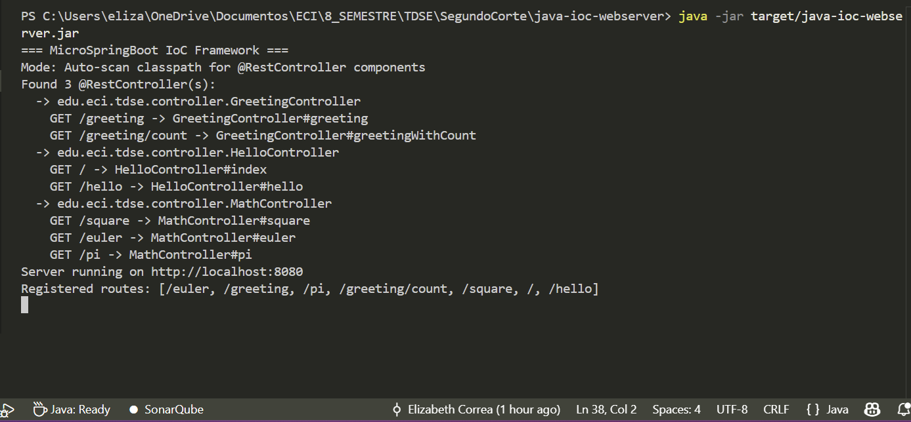

### Available endpoints

| Method | URL | Description |
|---|---|---|
| GET | `http://localhost:8080/` | Index page with endpoint listing |
| GET | `http://localhost:8080/hello` | Returns a plain Hello World message |
| GET | `http://localhost:8080/greeting?name=World` | Greeting using `@RequestParam` |
| GET | `http://localhost:8080/greeting` | Greeting with default value (`Hola World`) |
| GET | `http://localhost:8080/pi` | Returns the value of Pi |
| GET | `http://localhost:8080/square?num=5` | Returns the square of the given number |

### Endpoint screenshots

**Index page**

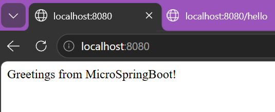

**GET /hello**

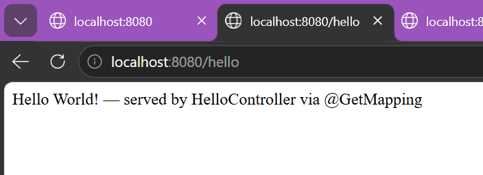

**GET /greeting?name=Elizabeth**

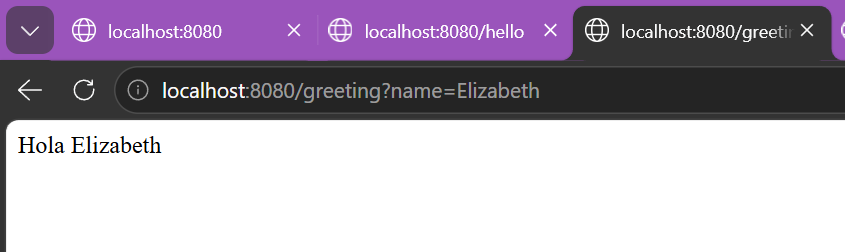

**GET /greeting — default value**

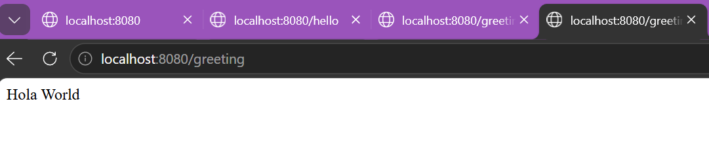

**GET /pi**

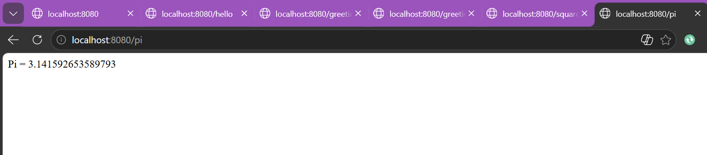

**GET /square?num=5**

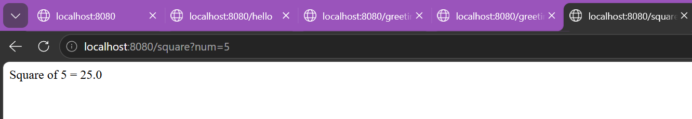

---

## AWS EC2 Deployment

### Instance setup guide

**Step 1 — Launch EC2 instance**

From the AWS Console, go to EC2 > Instances > Launch Instance and configure:

- Name: `java-ioc-webserver`
- AMI: Amazon Linux 2023
- Instance type: t3.micro
- Key pair: create a new `.pem` key and save it in a secure local folder

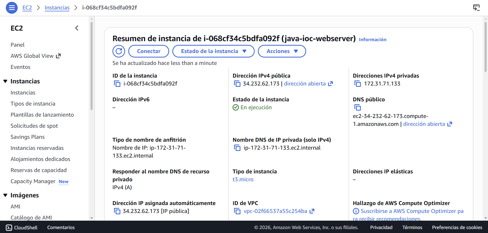

**Step 2 — Configure security group to open port 8080**

Go to the instance Security tab, click the security group link, then Edit inbound rules and add:

- Type: Custom TCP
- Port range: 8080
- Source: 0.0.0.0/0
- Description: IoC Web Server

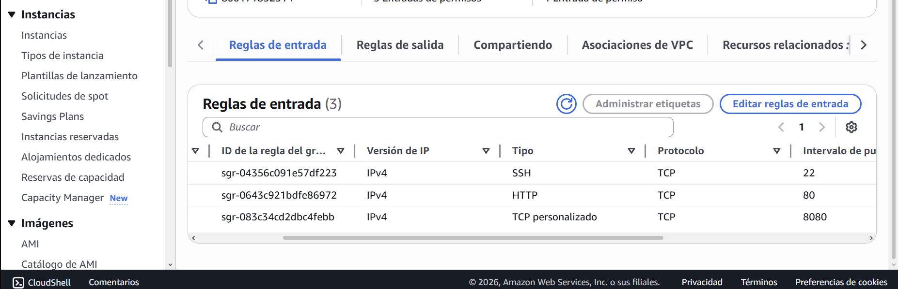

**Step 3 — Connect via SSH**

Open a terminal in the folder where your `.pem` file is saved and run:

```bash
# Give the key the correct permissions (Linux / Mac / Git Bash on Windows)
chmod 400 java-ioc-key.pem

# Connect
ssh -i "java-ioc-key.pem" ec2-user@34.232.62.173
```

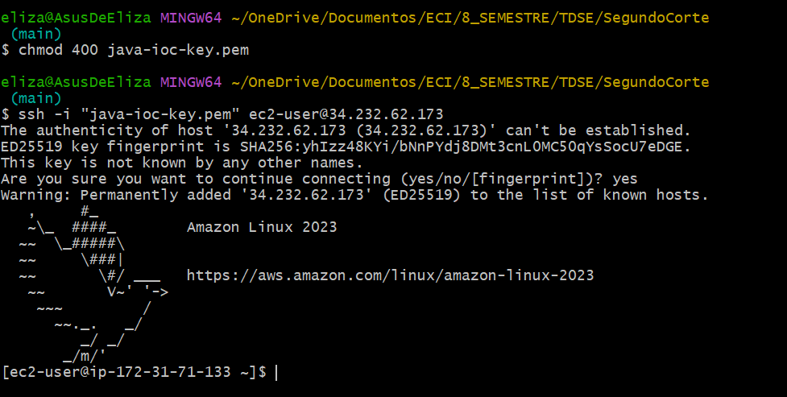

**Step 4 — Install Java on the instance**

Once connected to the instance:

```bash
sudo yum install java-21-amazon-corretto-devel -y
java -version
```

The `-y` flag auto-confirms all prompts during installation.

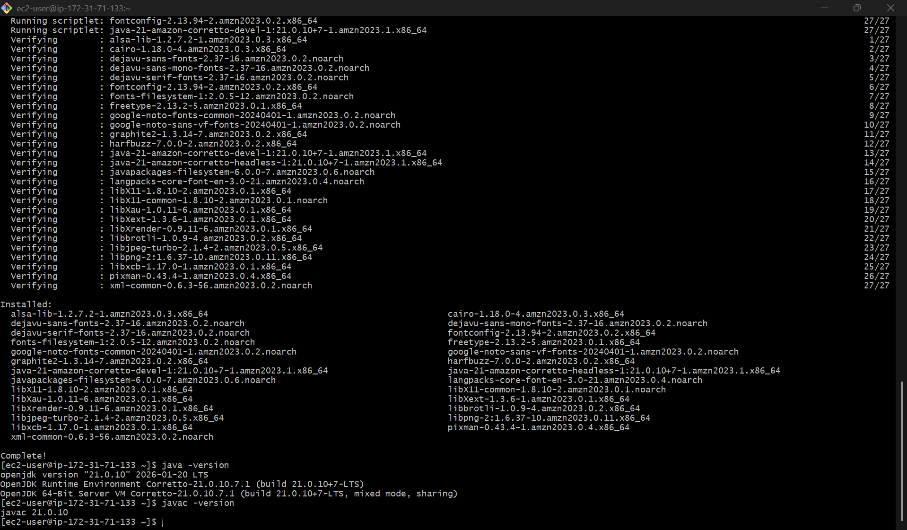

**Step 5 — Transfer the JAR from your local machine**

Open a second terminal (without closing the SSH session) and run from inside the project folder:

```bash
scp -i "path/to/java-ioc-key.pem" target/java-ioc-webserver.jar ec2-user@34.232.62.173:~
```

**Step 6 — Run the server on the instance**

Back in the SSH terminal:

```bash
java -jar java-ioc-webserver.jar
```

### Startup on AWS

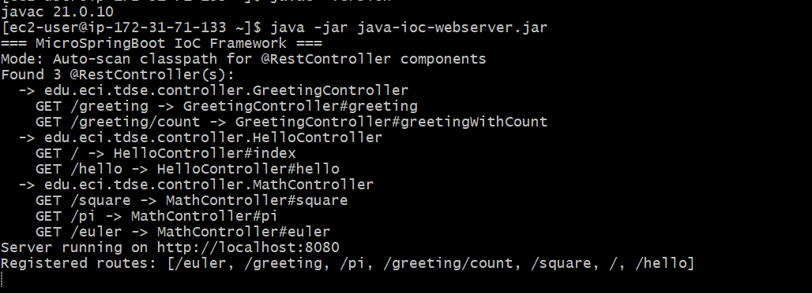

### Available endpoints on AWS

| Method | URL | Description |
|---|---|---|
| GET | `http://34.232.62.173:8080/` | Index page |
| GET | `http://34.232.62.173:8080/hello` | Hello World |
| GET | `http://34.232.62.173:8080/greeting?name=World` | Greeting with name parameter |
| GET | `http://34.232.62.173:8080/greeting` | Greeting with default value |
| GET | `http://34.232.62.173:8080/pi` | Pi value |
| GET | `http://34.232.62.173:8080/square?num=5` | Square of a number |

### Endpoint screenshots on AWS

**Index page**

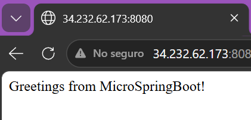

**GET /hello**

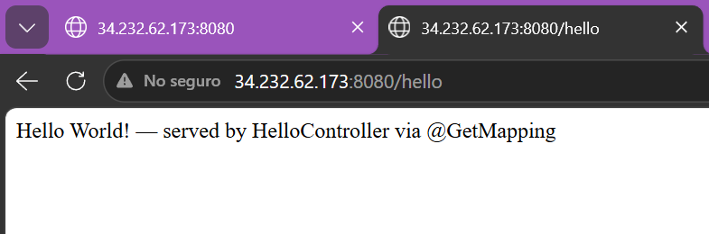

**GET /greeting?name=Elizabeth**

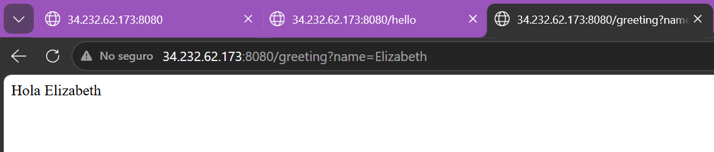

**GET /greeting — default value**

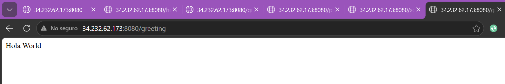

**GET /pi**

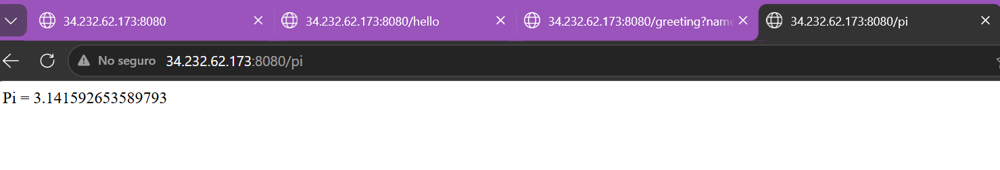

**GET /square?num=5**

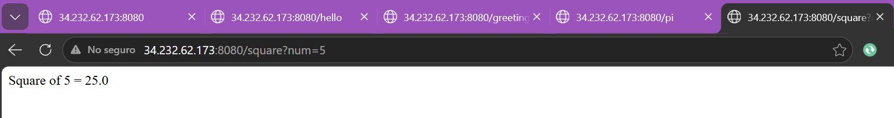

---

## Tests

The project includes four test suites that verify the core mechanics of the framework in isolation, without starting the server.

### Test suites

| Test class | What it verifies |
|---|---|
| `QueryStringParserTest` | Parses single and multiple query parameters correctly. Handles URL-encoded values (e.g. `Hello+World` → `Hello World`), null input, blank input, and parameters without a value. |
| `MimeTypesTest` | Maps file extensions to the correct MIME type. Covers HTML, PNG, CSS, JS, unknown extensions, and null filenames. |
| `ComponentScannerTest` | Verifies that `@RestController`, `@GetMapping`, and `@RequestParam` are retained at runtime and readable via reflection. Also confirms that controllers can be instantiated and their methods invoked through `method.invoke()`. |
| `GreetingControllerTest` | Tests the `GreetingController` logic in isolation. Verifies that the greeting responds correctly with a custom name, with the default name, and that the request counter increments on each call. |

### Running the tests

```bash
mvn test
```

### Test results

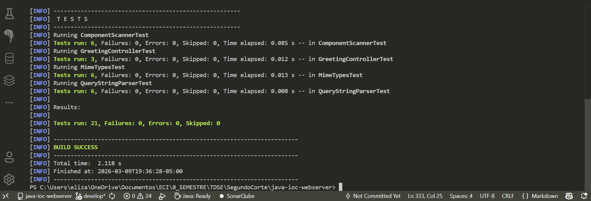

---

## Author

**Elizabeth Correa Suarez**